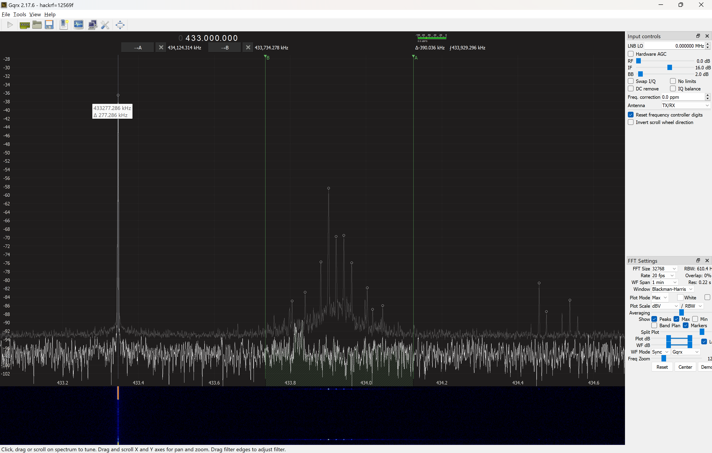
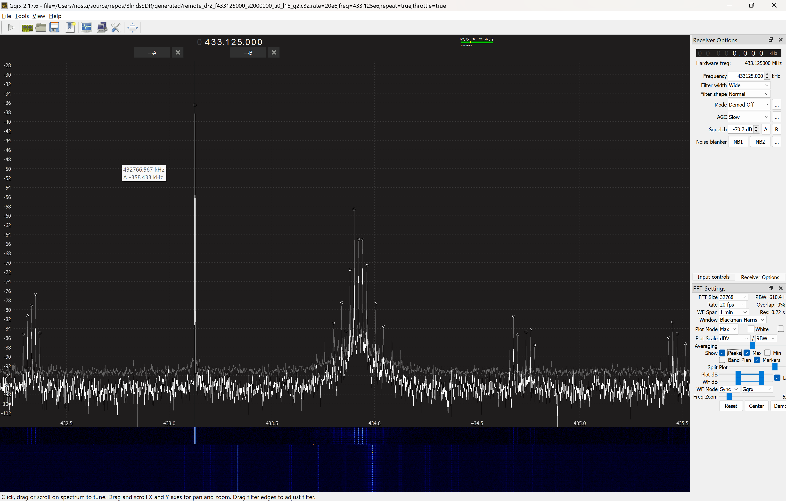

# Rollease Acmeda ARC Protocol Details
## Background
I bought a bunch of blinds from TheShadeStore with the idea of integrating them
into my home automation system. These are white-label blinds manufactured by
Rollease Acmeda.

TheShadeStore sold me handheld remotes [MT-0101-072002-A](https://www.automateshades.com/resource/product-quick-reference-guide-paradigm-plus-remote/) for each room which work reasonably well.

They also sold me an [Automate Pulse 2 Hub](https://rolleaseacmedamotors.com/products/rollease-acmeda-automate-pulse-2). The way this works is
that a phone app sends a command to the hub via wifi and
the hub issues a command to the blinds via the ARC protocol.

The hub does not work well in my experience. The installers from TheShadeStore were able to pair the hub to the blinds but
it would not stay connected.

I reached out to tech support on multiple occasions; they would send someone out to the house. They would spend time
moving things around and getting stuff paired again and
then it would stop working a day or two later.

The issue seems deeper than a radio strenth problem. When placing the blind right next to the hub (well within range of the handheld remote), the hub would not pair.

## Hardware

* U1: [ESP32-DOWD V1](https://documentation.espressif.com/esp32_datasheet_en.pdf) - MPU/WiFi
* U2: [Winbond 25Q32JV](https://www.winbond.com/hq/product/code-storage-flash-memory/serial-nor-flash/?__locale=en&partNo=W25Q32JV) - 32Mb NOR Flash
* U3: Unpopulated (TSSOP-8 or MSOP-8 package)
* U4: **Not found?**
* U5: [SMSC 8720A](https://ww1.microchip.com/downloads/en/DeviceDoc/8720a.pdf) - 0/100 Mbps Ethernet PHY transceiver
* U6: **Not found?**
* U7: [ST L051K86](https://www.st.com/en/microcontrollers-microprocessors/stm32l051k8.html) - MPU
* U8: [Si 44602A](https://www.silabs.com/documents/public/data-sheets/Si4463-61-60-C.pdf) - Radio tranciever
* U9: Unpopulated (SOIC-8, TSSOP-8, or MSOP-8)
* U10: **Not found?**
* U11: **Unknown** - silver near ISM antenna
* U12: **Unknown** - near WiFi antenna
* U13: Unpopulated (DFN-8 or MSOP-8)
* U14: **Unknown** - small black bga; plausibly `ATECC508A` for AWS IoT authentication
* U15: **Unknown** - marked with 8536; near multi-color LED.
* U16: Unpopulated (SOT-23-6)
* U17: **Unknown** - LDO?

There are a lot of test points; the largest designator I see is TP35 but I only count 32. TP13-16 break out the SPI pins on the si4460.

### Test Points for Si4460 SPI
In the orientation of the photo, the SPI pins are broken out as test points.
They are left and below the chip.
|Pin|TP  |Description
|---|----|-----------
|12 |TP15|SCLK
|15 |TP16|nSEL
|13 |TP14|SDO
|14 |TP13|SDI

### ESP32 flashing pins
|Pin|TP        |Description
|---|----------|-----------
|   |       TP1|3V3 (also unpopulated header J3)
|   |       TP4|EN (also unpopulated header J3)
|   |       TP5|Ground (also unpopulated header J3)
|   |       TP6|Ground (also unpopulated header J2)
|   |       TP1|Ground (also unpopulated header J4)
|   |       TP8|RXI (also unpopulated header J2)
|   |(unlabled)|TXD (also unpopulated header J2)
|   |       "0"|GPIO0 (no header, above eth port on right)

## SPI Trace
I was able to follow the directions to flash a hub with ESPHome; while I was
soldering to the PCB, I attached wires to the SPI and used that to capture the
SPI traffic between the 6640 and the STM32L051 chip. See [PulseView file](data/SPI%20Boot%20Capture.sr).

There were some malformed updates, but here are the distinct `SET_PROPERTY` commands (starting
with `0x11`, then a group, then a count of bytes to set, then a starting offset, then count bytes):
```
11 01 02 00 05 3A
11 02 01 00 0A
11 10 01 04 31
11 11 05 00 03 B4 2B B4 2B
11 12 01 10 08
11 12 03 6F FF FF FF
11 12 04 36 FF FF FF FF
11 12 07 0E 01 04 80 00 3F 00 2A
11 12 07 22 01 04 80 00 3F 00 0A
11 12 0A 00 04 01 08 FF FF 20 82 00 2A 01
11 20 02 0B 05 76
11 20 02 50 84 0A
11 20 02 54 83 41
11 20 03 30 02 10 80
11 20 06 5A 89 62 64 06 78 24
11 20 07 00 03 00 07 0C 35 00 09
11 20 08 38 11 15 15 80 1A 40 00 00
11 20 09 45 8F 00 DE 01 00 44 06 0A 1A
11 20 0C 18 01 80 08 03 80 00 20 20 00 E8 00 5E
11 20 0C 24 05 76 1A 02 B9 02 C0 00 94 23 81 56
11 21 06 2E 7D 40 A0 44 28 20 57
11 21 0C 00 CC A1 30 A0 21 D1 B9 C9 EA 05 12 11
11 21 0C 0C 0A 04 15 FC 03 00 CC A1 30 A0 21 D1
11 21 0C 18 B9 C9 EA 05 12 11 0A 04 15 FC 03 00
11 22 04 00 18 10 C0 1D
11 40 08 00 38 0E DA 74 44 44 20 FE
11 61 0C 18 B9 C9 EA 05 12 11 0A 04 15 FC 03 00
```

That maps to:

Name                            |Prop |Default|SPI Value|
--------------------------------|-----|-------|----------|
GLOBAL_XO_TUNE                  |00:00|40     |          |
GLOBAL_CLK_CFG                  |00:01|00     |          |
GLOBAL_CONFIG                   |00:03|20     |          |
INT_CTL_ENABLE                  |01:00|04     |05        |
INT_CTL_PH_ENABLE               |01:01|00     |3A        |
FRR_CTL_A_MODE                  |02:00|01     |0A        |
FRR_CTL_B_MODE                  |02:01|02     |          |
FRR_CTL_C_MODE                  |02:02|03     |          |
FRR_CTL_D_MODE                  |02:03|04     |          |
PREAMBLE_TX_LENGTH              |10:00|08     |          |
PREAMBLE_CONFIG_STD_1           |10:01|14     |          |
PREAMBLE_CONFIG_NSTD            |10:02|00     |          |
PREAMBLE_CONFIG_STD_2           |10:03|0F     |          |
PREAMBLE_CONFIG                 |10:04|21     |31        |
PREAMBLE_PATTERN_31_24          |10:05|00     |          |
PREAMBLE_PATTERN_23_16          |10:06|00     |          |
PREAMBLE_PATTERN_15_8           |10:07|00     |          |
PREAMBLE_PATTERN_7_0            |10:08|00     |          |
SYNC_CONFIG                     |11:00|01     |03        |
SYNC_BITS_31_24                 |11:01|2D     |B4        |
SYNC_BITS_23_16                 |11:02|D4     |2B        |
SYNC_BITS_15_8                  |11:03|2D     |B4        |
SYNC_BITS_7_0                   |11:04|D4     |2B        |
SYNC_CONFIG2                    |11:05|00     |          |
PKT_CRC_CONFIG                  |12:00|00     |04        |
PKT_WHT_POLY_15_8               |12:01|01     |01        |
PKT_WHT_POLY_7_0                |12:02|08     |08        |
PKT_WHT_SEED_15_8               |12:03|FF     |FF        |
PKT_WHT_SEED_7_0                |12:04|FF     |FF        |
PKT_WHT_BIT_NUM                 |12:05|00     |20        |
PKT_CONFIG1                     |12:06|00     |82        |
PKT_CONFIG2                     |12:07|00     |00        |
PKT_LEN                         |12:08|00     |2A        |
PKT_LEN_FIELD_SOURCE            |12:09|00     |01        |
PKT_LEN_ADJUST                  |12:0A|00     |          |
PKT_TX_THRESHOLD                |12:0B|30     |          |
PKT_RX_THRESHOLD                |12:0C|30     |          |
PKT_FIELD_1_LENGTH_12_8         |12:0D|00     |          |
PKT_FIELD_1_LENGTH_7_0          |12:0E|00     |01        |
PKT_FIELD_1_CONFIG              |12:0F|00     |04        |
PKT_FIELD_1_CRC_CONFIG          |12:10|00     |08/80     |
PKT_FIELD_2_LENGTH_12_8         |12:11|00     |00        |
PKT_FIELD_2_LENGTH_7_0          |12:12|00     |3F        |
PKT_FIELD_2_CONFIG              |12:13|00     |00        |
PKT_FIELD_2_CRC_CONFIG          |12:14|00     |2A        |
PKT_FIELD_3_LENGTH_12_8         |12:15|00     |          |
PKT_FIELD_3_LENGTH_7_0          |12:16|00     |          |
PKT_FIELD_3_CONFIG              |12:17|00     |          |
PKT_FIELD_3_CRC_CONFIG          |12:18|00     |          |
PKT_FIELD_4_LENGTH_12_8         |12:19|00     |          |
PKT_FIELD_4_LENGTH_7_0          |12:1A|00     |          |
PKT_FIELD_4_CONFIG              |12:1B|00     |          |
PKT_FIELD_4_CRC_CONFIG          |12:1C|00     |          |
PKT_FIELD_5_LENGTH_12_8         |12:1D|00     |          |
PKT_FIELD_5_LENGTH_7_0          |12:1E|00     |          |
PKT_FIELD_5_CONFIG              |12:1F|00     |          |
PKT_FIELD_5_CRC_CONFIG          |12:20|00     |          |
PKT_RX_FIELD_1_LENGTH_12_8      |12:21|00     |          |
PKT_RX_FIELD_1_LENGTH_7_0       |12:22|00     |01        |
PKT_RX_FIELD_1_CONFIG           |12:23|00     |04        |
PKT_RX_FIELD_1_CRC_CONFIG       |12:24|00     |80        |
PKT_RX_FIELD_2_LENGTH_12_8      |12:25|00     |00        |
PKT_RX_FIELD_2_LENGTH_7_0       |12:26|00     |3F        |
PKT_RX_FIELD_2_CONFIG           |12:27|00     |00        |
PKT_RX_FIELD_2_CRC_CONFIG       |12:28|00     |0A        |
PKT_RX_FIELD_3_LENGTH_12_8      |12:29|00     |          |
PKT_RX_FIELD_3_LENGTH_7_0       |12:2A|00     |          |
PKT_RX_FIELD_3_CONFIG           |12:2B|00     |          |
PKT_RX_FIELD_3_CRC_CONFIG       |12:2C|00     |          |
PKT_RX_FIELD_4_LENGTH_12_8      |12:2D|00     |          |
PKT_RX_FIELD_4_LENGTH_7_0       |12:2E|00     |          |
PKT_RX_FIELD_4_CONFIG           |12:2F|00     |          |
PKT_RX_FIELD_4_CRC_CONFIG       |12:30|00     |          |
PKT_RX_FIELD_5_LENGTH_12_8      |12:31|00     |          |
PKT_RX_FIELD_5_LENGTH_7_0       |12:32|00     |          |
PKT_RX_FIELD_5_CONFIG           |12:33|00     |          |
PKT_RX_FIELD_5_CRC_CONFIG       |12:34|00     |          |
PKT_CRC_SEED_31_24              |12:35|00     |          |
PKT_CRC_SEED_23_16              |12:36|00     |FF        |
PKT_CRC_SEED_15_8               |12:37|00     |FF        |
PKT_CRC_SEED_7_0                |12:38|00     |FF        |
MODEM_MOD_TYPE                  |20:00|02     |03        |
MODEM_MAP_CONTROL               |20:01|80     |00        |
MODEM_DSM_CTRL                  |20:02|07     |07        |
MODEM_DATA_RATE_2               |20:03|0F     |0C        |
MODEM_DATA_RATE_1               |20:04|42     |35        |
MODEM_DATA_RATE_0               |20:05|40     |00        |
MODEM_TX_NCO_MODE_3             |20:06|01     |09        |
MODEM_TX_NCO_MODE_2             |20:07|C9     |          |
MODEM_TX_NCO_MODE_1             |20:08|C3     |          |
MODEM_TX_NCO_MODE_0             |20:09|80     |          |
MODEM_FREQ_DEV_2                |20:0A|00     |          |
MODEM_FREQ_DEV_1                |20:0B|06     |05        |
MODEM_FREQ_DEV_0_1              |20:0C|D3     |76        |
(Gap 20:0D-20:17)               |     |       |          |
MODEM_TX_RAMP_DELAY             |20:18|01     |01        |
MODEM_MDM_CTRL                  |20:19|00     |80        |
MODEM_IF_CONTROL                |20:1A|08     |08        |
MODEM_IF_FREQ_2                 |20:1B|03     |03        |
MODEM_IF_FREQ_1                 |20:1C|C0     |80        |
MODEM_IF_FREQ_0                 |20:1D|00     |00        |
MODEM_DECIMATION_CFG1           |20:1E|10     |20        |
MODEM_DECIMATION_CFG0           |20:1F|20     |20        |
MODEM_DECIMATION_CFG2           |20:20|00     |00        |
MODEM_IFPKD_THRESHOLDS          |20:21|00     |E8        |
MODEM_BCR_OSR_1                 |20:22|00     |00        |
MODEM_BCR_OSR_0                 |20:23|4B     |5E        |
MODEM_BCR_NCO_OFFSET_2          |20:24|06     |          |
MODEM_BCR_NCO_OFFSET_1          |20:25|D3     |          |
MODEM_BCR_NCO_OFFSET_0          |20:26|A0     |          |
MODEM_BCR_GAIN_1                |20:27|06     |          |
MODEM_BCR_GAIN_0                |20:28|D3     |          |
MODEM_BCR_GEAR                  |20:29|02     |          |
MODEM_BCR_MISC1                 |20:2A|C0     |          |
MODEM_BCR_MISC0                 |20:2B|00     |          |
MODEM_AFC_GEAR                  |20:2C|00     |          |
MODEM_AFC_WAIT                  |20:2D|23     |          |
MODEM_AFC_GAIN_1                |20:2E|83     |          |
MODEM_AFC_GAIN_0                |20:2F|69     |          |
MODEM_AFC_LIMITER_1             |20:30|00     |02        |
MODEM_AFC_LIMITER_0             |20:31|40     |10        |
MODEM_AFC_MISC                  |20:32|A0     |80        |
MODEM_AGC_CONTROL               |20:35|E0     |          |
MODEM_AGC_WINDOW_SIZE           |20:38|11     |11        |
MODEM_AGC_RFPD_DECAY            |20:39|10     |15        |
MODEM_AGC_IFPD_DECAY            |20:3A|10     |15        |
MODEM_FSK4_GAIN1                |20:3B|0B     |80        |
MODEM_FSK4_GAIN0                |20:3C|1C     |1A        |
MODEM_FSK4_TH1                  |20:3D|40     |40        |
MODEM_FSK4_TH0                  |20:3E|00     |00        |
MODEM_FSK4_MAP                  |20:3F|00     |00        |
MODEM_OOK_PDTC                  |20:40|2B     |          |
MODEM_OOK_BLOPK                 |20:41|0C     |          |
MODEM_OOK_CNT1                  |20:42|A4     |          |
MODEM_OOK_MISC                  |20:43|03     |          |
MODEM_RAW_CONTROL               |20:45|02     |8F        |
MODEM_RAW_EYE_1                 |20:46|00     |00        |
MODEM_RAW_EYE_0                 |20:47|A3     |DE        |
MODEM_ANT_DIV_MODE              |20:48|02     |01        |
MODEM_ANT_DIV_CONTROL           |20:49|80     |00        |
MODEM_RSSI_JUMP_THRESH          |20:4B|0C     |06        |
MODEM_RSSI_CONTROL2             |20:4D|00     |1A        |
MODEM_RSSI_COMP                 |20:4E|40     |          |
MODEM_RAW_SEARCH2               |20:50|00     |84        |
MODEM_CLKGEN_BAND               |20:51|08     |0A        |
MODEM_SPIKE_DET                 |20:54|00     |83        |
MODEM_ONE_SHOT_AFC              |20:55|00     |41        |
MODEM_RSSI_MUTE                 |20:57|00     |          |
MODEM_DSA_CTRL1                 |20:5B|00     |62        |
MODEM_DSA_CTRL2                 |20:5C|00     |64        |
MODEM_DSA_QUAL                  |20:5D|00     |06        |
MODEM_DSA_RSSI                  |20:5E|00     |78        |
MODEM_DSA_MISC                  |20:5F|00     |24        |
MODEM_CHFLT_RX1_CHFLT_COE13_7_0 |21:00|FF     |CC        |
MODEM_CHFLT_RX1_CHFLT_COE12_7_0 |21:01|BA     |A1        |
MODEM_CHFLT_RX1_CHFLT_COE11_7_0 |21:02|0F     |30        |
MODEM_CHFLT_RX1_CHFLT_COE10_7_0 |21:03|51     |A0        |
MODEM_CHFLT_RX1_CHFLT_COE9_7_0  |21:04|CF     |21        |
MODEM_CHFLT_RX1_CHFLT_COE8_7_0  |21:05|A9     |D1        |
MODEM_CHFLT_RX1_CHFLT_COE7_7_0  |21:06|C9     |B9        |
MODEM_CHFLT_RX1_CHFLT_COE6_7_0  |21:07|FC     |C9        |
MODEM_CHFLT_RX1_CHFLT_COE5_7_0  |21:08|1B     |EA        |
MODEM_CHFLT_RX1_CHFLT_COE4_7_0  |21:09|1E     |05        |
MODEM_CHFLT_RX1_CHFLT_COE3_7_0  |21:0A|0F     |21        |
MODEM_CHFLT_RX1_CHFLT_COE2_7_0  |21:0B|01     |11        |
MODEM_CHFLT_RX1_CHFLT_COE1_7_0  |21:0C|FC     |0A        |
MODEM_CHFLT_RX1_CHFLT_COE0_7_0  |21:0D|FD     |04        |
MODEM_CHFLT_RX1_CHFLT_COEM0     |21:0E|15     |15        |
MODEM_CHFLT_RX1_CHFLT_COEM1     |21:0F|FF     |FC        |
MODEM_CHFLT_RX1_CHFLT_COEM2     |21:10|00     |03        |
MODEM_CHFLT_RX1_CHFLT_COEM3     |21:11|0F     |00        |
MODEM_CHFLT_RX2_CHFLT_COE13_7_0 |21:12|FF     |CC        |
MODEM_CHFLT_RX2_CHFLT_COE12_7_0 |21:13|C4     |A1        |
MODEM_CHFLT_RX2_CHFLT_COE11_7_0 |21:14|30     |30        |
MODEM_CHFLT_RX2_CHFLT_COE10_7_0 |21:15|7F     |A0        |
MODEM_CHFLT_RX2_CHFLT_COE9_7_0  |21:16|F5     |21        |
MODEM_CHFLT_RX2_CHFLT_COE8_7_0  |21:17|B5     |D1        |
MODEM_CHFLT_RX2_CHFLT_COE7_7_0  |21:18|B8     |B9        |
MODEM_CHFLT_RX2_CHFLT_COE6_7_0  |21:19|DE     |C9        |
MODEM_CHFLT_RX2_CHFLT_COE5_7_0  |21:1A|05     |EA        |
MODEM_CHFLT_RX2_CHFLT_COE4_7_0  |21:1B|17     |05        |
MODEM_CHFLT_RX2_CHFLT_COE3_7_0  |21:1C|16     |12        |
MODEM_CHFLT_RX2_CHFLT_COE2_7_0  |21:1D|0C     |11        |
MODEM_CHFLT_RX2_CHFLT_COE1_7_0  |21:1E|03     |0A        |
MODEM_CHFLT_RX2_CHFLT_COE0_7_0  |21:1F|00     |04        |
MODEM_CHFLT_RX2_CHFLT_COEM0     |21:20|15     |15        |
MODEM_CHFLT_RX2_CHFLT_COEM1     |21:21|FF     |FC        |
MODEM_CHFLT_RX2_CHFLT_COEM2     |21:22|00     |03        |
MODEM_CHFLT_RX2_CHFLT_COEM3     |21:23|00     |00        |
PA_MODE                         |22:00|08     |18        |
PA_PWR_LVL                      |22:01|7F     |10        |
PA_BIAS_CLKDUTY                 |22:02|00     |0C        |
PA_TC                           |22:03|5D     |1D        |
SYNTH_PFDCP_CPFF                |23:00|2C     |          |
SYNTH_PFDCP_CPINT               |23:01|0E     |          |
SYNTH_VCO_KV                    |23:02|0B     |          |
SYNTH_LPFILT3                   |23:03|04     |          |
SYNTH_LPFILT2                   |23:04|0C     |          |
SYNTH_LPFILT1                   |23:05|73     |          |
SYNTH_LPFILT0                   |23:06|03     |          |
MATCH_VALUE_1                   |30:00|00     |          |
MATCH_MASK_1                    |30:01|00     |          |
MATCH_CTRL_1                    |30:02|00     |          |
MATCH_VALUE_2                   |30:03|00     |          |
MATCH_MASK_2                    |30:04|00     |          |
MATCH_CTRL_2                    |30:05|00     |          |
MATCH_VALUE_3                   |30:06|00     |          |
MATCH_MASK_3                    |30:07|00     |          |
MATCH_CTRL_3                    |30:08|00     |          |
MATCH_VALUE_4                   |30:09|00     |          |
MATCH_MASK_4                    |30:0A|00     |          |
MATCH_CTRL_4                    |30:0B|00     |          |
FREQ_CONTROL_INTE               |40:00|3C     |38        |
FREQ_CONTROL_FRAC_2             |40:01|08     |0E        |
FREQ_CONTROL_FRAC_1             |40:02|00     |DA        |
FREQ_CONTROL_FRAC_0             |40:03|00     |74        |
FREQ_CONTROL_CHANNEL_STEP_SIZE_1|40:04|00     |44        |
FREQ_CONTROL_CHANNEL_STEP_SIZE_0|40:05|00     |44        |
FREQ_CONTROL_W_SIZE             |40:06|20     |20        |
FREQ_CONTROL_VCOCNT_RX_ADJ      |40:07|FF     |FE        |

## Documents
[FCC Details](https://fccid.io/pdf.php?id=4975342). The 433MHz grant is specifically for 433.92MHz-433.92MHz (no range)

## Other work
There seems to be a high level protocol `'!' + address[0] + address[1] + address[3] + command + param[0] + param[1] ... + ';'`.
|command|data|description
|-|-|-
|o||Open/Up
|c||Close/Down
|s||Stop
|oA||Jog Open/Up
|cA||Jog Close/Down
|m|DDD|Move by percentage
|b|DDD|Rotate angle by percentage

### HACS component
I'm using [Home Assistant HACS Component](https://github.com/sillyfrog/Automate-Pulse-v2?tab=readme-ov-file) and [Python Module](https://github.com/sillyfrog/aiopulse2). This would be my preferred option except that the hub itself has problems communicating with the blinds.

### ESPHome component
I just found an [ESPHome component](https://github.com/redstorm1/arc-bridge) (with [blog post](https://www.geektech.co.nz/esphome-pulse-2-hub)). It has this helpful snippet:
> #### Electrical Architecture
> * The ESP32 communicates with the STM32L051 over UART (115200 baud, 8N1).
> * The STM32 controls the RF transmitter for ARC radio communication.
> * The LAN8720A provides wired Ethernet; clocked externally through GPIO 0.
> * The PCA9554 handles LED outputs and expansion pins via I²C (SDA = GPIO 14, SCL = GPIO 4).
> * Power distribution is 3.3 V throughout the logic section.
>
> This architecture allows ESPHome to use Ethernet networking while simultaneously driving the RF microcontroller through UART.

I suspect, based on PCB layout, the `PC9554` is `U15` (labeled `8536`). This is not the most important part.

### Serial Protocol
I found a documents with the [Serial Protocol for Pulse Blinds](https://www.avoutlet.com/images/product/additional/r/pulse-serial-instructions.pdf) on this
[Bond Home forum thread](https://forum.bondhome.io/t/rollease-acmeda-and-dooya-motorized-shades/413/3). It suggests 9600 baud, 8N1.

## Capture Process
### GQRX Survey
Here's a screen shot from GQRX:

It shows energy around 433.92MHz (as expected). But the DC spike seems to be at
433.277MHz rather than the 433.0MHz targeted by the tuning parameter.

### `hackrf_transfer` capture
Here's my attempt to replicate that with the command line tool.
```bash
hackrf_transfer -f 433125000 -s 20000000 -a 0 -l 16 -g 2 -n 80000000 -r $datadir/remote_dr2_f433125000_s2000000_a0_l16_g2.iq
```
Which yields:
```
call hackrf_set_sample_rate(20000000 Hz/20.000 MHz)
call hackrf_set_hw_sync_mode(0)
call hackrf_set_freq(433125000 Hz/433.125 MHz)
call hackrf_set_amp_enable(0)
samples_to_xfer 80000000/80Mio
Stop with Ctrl-C
39.6 MiB / 1.014 sec = 39.0 MiB/second, average power -33.2 dBfs
39.3 MiB / 0.996 sec = 39.5 MiB/second, average power -33.1 dBfs
39.6 MiB / 1.001 sec = 39.6 MiB/second, average power -33.1 dBfs
39.6 MiB / 1.002 sec = 39.5 MiB/second, average power -33.1 dBfs
 2.1 MiB / 0.047 sec = 44.3 MiB/second, average power -33.3 dBfs

Exiting...
Total time: 4.05986 s
hackrf_stop_rx() done
hackrf_close() done
hackrf_exit() done
fclose() done
exit
```

I then convert the int8 to complex float 32:
```python
import numpy as np

def load_hackrf_iq(path):
    raw = np.fromfile(path, dtype=np.int8)
    iq = raw.reshape(-1, 2)
    return (iq[:, 0].astype(np.float32) + 1j * iq[:, 1].astype(np.float32)) / 128.0

def save_to_gqrx_float32(x, path):
    interleaved = np.empty(2 * len(x), dtype=np.float32)
    interleaved[0::2] = x.real.astype(np.float32)
    interleaved[1::2] = x.imag.astype(np.float32)
    interleaved.tofile(path)

samples = load_hackrf_iq('data/remote_dr2_f433125000_s2000000_a0_l16_g2.iq')
save_to_gqrx_float32(samples, 'generated/remote_dr2_f433125000_s2000000_a0_l16_g2.c32')
```

After opening GQRX with the device string of `file=generated/dining_room_2_f433000000_s2000000.c32,freq=433.0e6,rate=20e6,repeat=true,throttle=true`, and setting the frequency to `0` in the **Receiver Options** tab, I get this:
